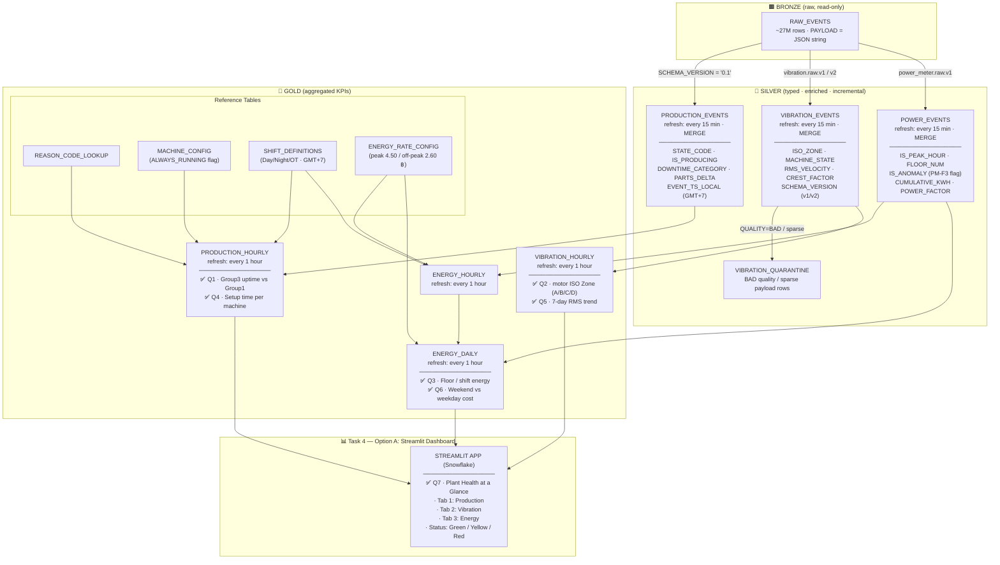
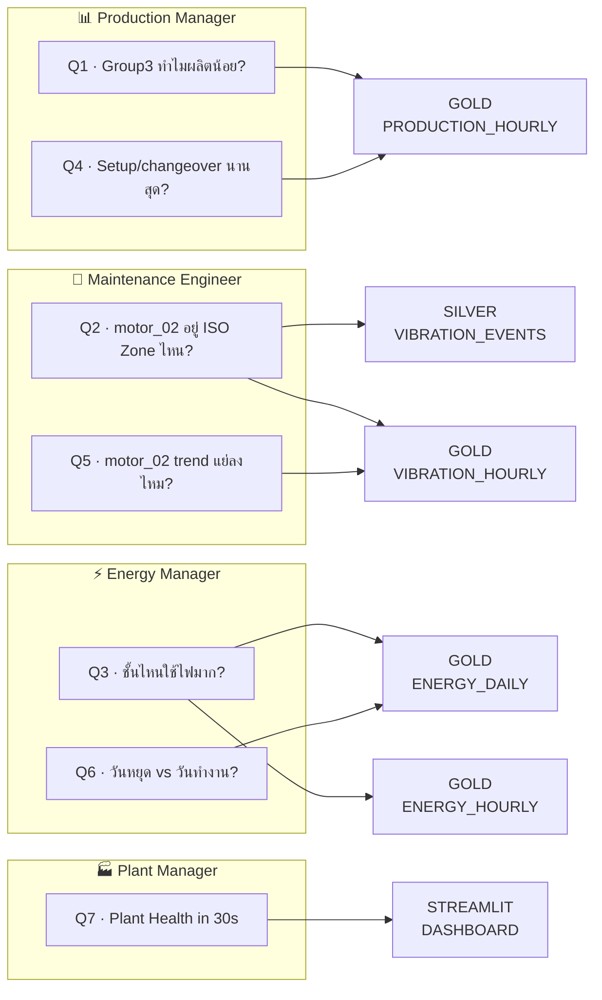

# DESIGN.md — Compomax DE Challenge 2026

> Author scope: **Production + Vibration + Power/Energy** (implement ครบ) · **Capstone: Option A** (Streamlit Dashboard — 3 tabs)  
> **Verified on Snowflake** (2026-06-25): Silver/Gold pipelines รันแล้ว — ดู row counts ใน [`PLAN.md`](PLAN.md)

---

## Project Scope

| Area | Status | ตอบคำถาม |
|------|--------|----------|
| Production | ✅ Implemented | Q1, Q4 |
| Vibration | ✅ Implemented | Q2, Q5 |
| Power / Energy | ✅ Implemented | Q3, Q6 |
| Capstone | ✅ **Option A — Streamlit Dashboard** | Q7 |

เริ่มต้น defer Power เพื่อทำ 2 domain ให้ลึกก่อน แล้วเพิ่ม domain ที่ 3 ก่อนส่งงาน — ตอนนี้ครบ pipeline ทั้ง 3 domain + Gold + dashboard

---

## 1. Architecture Diagram

> 2 diagrams: **§1.1 Medallion Overview** (data flow + Q mapping) + **§1.2 Business Questions** (Q → table lookup)

### 1.1 Medallion Overview



### 1.2 Business Questions Mapping



| Q | ตาราง | สถานะ |
|---|-------|-------|
| Q1, Q4 | `GOLD.PRODUCTION_HOURLY` | ✅ |
| Q2 | `SILVER.VIBRATION_EVENTS` + `GOLD.VIBRATION_HOURLY` | ✅ |
| Q5 | `GOLD.VIBRATION_HOURLY` | ✅ |
| Q3 | `GOLD.ENERGY_DAILY` + `GOLD.ENERGY_HOURLY` | ✅ |
| Q6 | `GOLD.ENERGY_DAILY` | ✅ |
| Q7 | `STREAMLIT DASHBOARD` | ✅ Option A |

### Refresh Schedule

| Layer | Object | Schedule | Warehouse |
|-------|--------|----------|-----------|
| Silver | `PRODUCTION_EVENTS` | Every 15 min (Task) | `CHALLENGE_WH` |
| Silver | `VIBRATION_EVENTS` | Every 15 min (Task) | `CHALLENGE_WH` |
| Silver | `POWER_EVENTS` | Every 15 min (Task) | `CHALLENGE_WH` |
| Gold | `PRODUCTION_HOURLY` | Every 1 hour (Task) | `CHALLENGE_WH` |
| Gold | `VIBRATION_HOURLY` | Every 1 hour (Task) | `CHALLENGE_WH` |
| Gold | `ENERGY_HOURLY` + `ENERGY_DAILY` | Every 1 hour (Task) | `CHALLENGE_WH` |
| Capstone | Streamlit Dashboard (query on-demand) | — | `CHALLENGE_WH` |

---

## 2. Decision Log

| # | การตัดสินใจ | ทำไมเลือกแบบนี้ | ทางเลือกที่พิจารณาแล้วไม่เลือก |
|---|------------|----------------|-------------------------------|
| 1 | **Scope: ครบ 3 domain (Prod + Vib + Power)** | เริ่มจาก 2 domain ให้ลึก แล้วเพิ่ม Power ก่อนส่ง — ตอบ Q1–Q7 ครบ + bonus Gold 3 domain | ทำแค่ 2 domain — Q3/Q6 ตอบไม่ได้ |
| 2 | **Capstone: Option A (Streamlit Dashboard)** | ตอบ Q7 "ดูใน 30 วินาที" ได้ visual ที่สุด; demo ใน video น่าประทับใจ; ใช้ Gold ทั้ง 3 domain | Option B (Alert) demo ไม่ visual เท่า; Option C (Cortex ML) risky + ใช้เวลามากกว่า |
| 3 | **Incremental: Stream + Task + MERGE** | Idempotent รองรับ duplicate 73K groups; ควบคุม watermark ได้; เหมาะกับ challenge ที่เน้น MERGE | Dynamic Table — ง่ายแต่ custom quarantine/error handling ยาก; Full scan SP — ช้า |
| 4 | **Timezone: convert ที่ Silver (`EVENT_TS_LOCAL`)** | Gold/Capstone ใช้ shift local (00:45–09:45 ฯลฯ) ซ้ำได้ทุก layer; ลด bug timezone | Convert ที่ Gold — ต้องทำซ้ำทุก aggregation |
| 5 | **803105 No Order = `EXCLUDED`** | 45% ของ Group3 เป็น no order — นับเป็น downtime จะตอบ Q1 ผิด | นับเป็น UNPLANNED_DOWNTIME — uptime ต่ำเกินจริง |
| 6 | **ALWAYS_RUNNING (FM48, FM51, FM44): flag + exclude จาก throughput** | state=800 แต่ parts_delta=0 ตลอด — นับ IS_PRODUCING จะหลอก OEE | นับ running ตาม state อย่างเดียว — FM51 ดู productive 77% แต่จริง 0% |
| 7 | **Vibration v1→v2: single `VIBRATION_EVENTS` table** | OBJECT_KEYS เหมือนกันใน full payload; แยกด้วย `SCHEMA_VERSION` | แยก 2 tables — join Gold ยากขึ้นโดยไม่จำเป็น |
| 8 | **QUALITY=BAD → quarantine table** | 1,349 rows; sparse v2 payload 12 rows — ไม่ปน ISO calculation | Filter silently — สูญเสีย audit trail |
| 9 | **MERGE key: `EVENT_ID = ASSET\|EVENT_TS\|SCHEMA_VERSION`** | รองรับ delivery retry duplicates; idempotent | INSERT only — duplicate 73K+ groups |
| 10 | **Streamlit: 3 tabs (Production + Vibration + Energy)** | ครบ stakeholder questions; header แสดง overall status จาก prod + vib | 2 tabs อย่างเดียว — Energy Manager ไม่เห็น Q3/Q6 ใน dashboard |
| 11 | **PM-F3 `IS_ANOMALY = TRUE` — exclude จาก floor sum** | PM-F3 avg kW ≈ MAIN-MDB (wiring issue) — รวมจะ double-count plant load | ลบ PM-F3 ออกจาก Silver — สูญเสีย audit trail |

---

## 3. Data Quality Findings

สำรวจจาก [`docs/step1-bronze-exploration/RAW_EVENTS_FINDINGS.md`](docs/step1-bronze-exploration/RAW_EVENTS_FINDINGS.md)

| # | Finding | การจัดการ |
|---|---------|-----------|
| 1 | `PAYLOAD` เป็น VARCHAR (JSON string) | `PARSE_JSON(PAYLOAD)` ใน Silver transform |
| 2 | Production dual format (3s + 60s) | Unified columns: `STATE_CODE`, `PARTS_DELTA`, `PAYLOAD_FORMAT` |
| 3 | Duplicates 73,131 `(ASSET, EVENT_TS)` groups | MERGE on `EVENT_ID` |
| 4 | ALWAYS_RUNNING FM48/51/44 | `MACHINE_CONFIG.category` + `IS_PRODUCING` logic |
| 5 | No Order 803105 ครอง stopped time | `DOWNTIME_CATEGORY = 'EXCLUDED'` |
| 6 | Vibration QUALITY=BAD (1,349 rows) | `VIBRATION_QUARANTINE` |
| 7 | v1→v2 gap ~7.5 hr (11 Jun) | บันทึก gap; ไม่ interpolate |
| 8 | PM-F3 ≈ MAIN-MDB (Power) | `IS_ANOMALY = TRUE` ใน Silver + exclude จาก floor aggregation ใน Gold |
| 9 | motor_02 avg RMS 10.7 mm/s → Zone C | แสดงใน Streamlit header + Vibration tab (Zone C = Yellow) |
| 10 | Power QUALITY=BAD (5 rows, ASSET=NULL) | Filter ออกจาก MERGE ใน `02_silver_power.sql` |

**แจ้ง Plant Manager / IT (งานจริง):** FM48/51/44 counter ไม่เดิน; PM-F3 wiring; motor_02 Zone C แนวโน้มแย่ (rolling 7-day RMS สูงขึ้น)

---

## 4. Business Questions Mapping

### Q1 — Group3 ทำไมผลิตน้อยกว่า Group1?

```sql
SELECT
    MACHINE_GROUP,
    COUNT(DISTINCT ASSET)                            AS machines,
    ROUND(AVG(UPTIME_PCT), 1)                        AS avg_uptime_pct,
    ROUND(SUM(PARTS_PRODUCED) / COUNT(DISTINCT ASSET), 0) AS parts_per_machine
FROM DE_CHALLENGE.GOLD.PRODUCTION_HOURLY
GROUP BY MACHINE_GROUP, GROUP_NUMBER
ORDER BY GROUP_NUMBER;
```

**Verified (Gold):** Group1 **50.4%** uptime vs Group3 **16.2%** — Group3 ต่ำกว่าเกือบ 3 เท่า; สาเหตุหลัก = No Order (803105) ถูก EXCLUDED จาก uptime denominator แต่ยังเห็นใน reading mix

### Q2 — motor_02 อยู่ ISO Zone ไหน?

```sql
SELECT asset,
       ROUND(AVG(x_rms_velocity_mm_s), 2) AS avg_rms,
       MODE(iso_zone)                     AS iso_zone
FROM DE_CHALLENGE.SILVER.VIBRATION_EVENTS
WHERE asset = 'motor_02'
  AND event_ts_local >= DATEADD('day', -7, CURRENT_TIMESTAMP())
GROUP BY asset;
```

**Verified:** avg RMS ~10.7 mm/s → **Zone C**

### Q3 — ชั้นไหนใช้ไฟมาก / กะไหนเปลือง

```sql
-- Q3a: kWh ต่อชั้น (exclude PM-F3 anomaly + MAIN-MDB total)
SELECT ASSET, FLOOR_NUM,
       ROUND(SUM(TOTAL_KWH), 0) AS total_kwh
FROM DE_CHALLENGE.GOLD.ENERGY_DAILY
WHERE IS_ANOMALY = FALSE AND ASSET != 'MAIN-MDB'
GROUP BY ASSET, FLOOR_NUM
ORDER BY total_kwh DESC;

-- Q3b: kWh ต่อกะ (plant total)
SELECT h.SHIFT_NAME,
       ROUND(SUM(h.HOURLY_KWH), 0) AS shift_kwh
FROM DE_CHALLENGE.GOLD.ENERGY_HOURLY h
WHERE h.IS_ANOMALY = FALSE AND h.ASSET = 'MAIN-MDB'
GROUP BY h.SHIFT_NAME
ORDER BY shift_kwh DESC;
```

**Verified:** PM-F1 (Floor 1) สูงสุด **4,359 kWh**; Night shift ใช้ไฟมากสุดใน plant total

### Q4 — เครื่องไหน setup นานสุด?

```sql
SELECT ASSET, MACHINE_GROUP,
       ROUND(SUM(SETUP_MINUTES) / 60.0, 1) AS total_setup_hours
FROM DE_CHALLENGE.GOLD.PRODUCTION_HOURLY
GROUP BY ASSET, MACHINE_GROUP
ORDER BY total_setup_hours DESC
LIMIT 10;
```

**Verified:** FM52 setup สูงสุด (~319 ชม.รวม)

### Q5 — motor_02 trend แย่ลงหรือไม่?

```sql
SELECT DATE_TRUNC('week', HOUR_LOCAL) AS week,
       ROUND(AVG(AVG_RMS_VELOCITY), 2) AS avg_rms,
       MAX(DOMINANT_ISO_ZONE)          AS worst_zone
FROM DE_CHALLENGE.GOLD.VIBRATION_HOURLY
WHERE ASSET = 'motor_02'
GROUP BY 1
ORDER BY 1;
```

**Verified:** rolling 7-day RMS แนวโน้ม **แย่ลง** สัปดาห์หลัง (12.6 mm/s)

### Q6 — วันหยุด vs วันทำงาน cost

```sql
SELECT IS_WEEKEND,
       ROUND(AVG(TOTAL_KWH), 1)       AS avg_daily_kwh,
       ROUND(AVG(TOTAL_COST_BAHT), 0)   AS avg_daily_cost_baht
FROM DE_CHALLENGE.GOLD.ENERGY_DAILY
WHERE ASSET = 'MAIN-MDB'
GROUP BY IS_WEEKEND
ORDER BY IS_WEEKEND;
```

**Verified:** weekday avg **1,839 kWh** vs weekend **692 kWh** → ลดลง **~62%**

### Q7 — Plant Health at a Glance (Option A: Streamlit)

**App:** [`streamlit/plant_health.py`](streamlit/plant_health.py) — deploy บน Snowflake (`DE_CHALLENGE.GOLD.STREAMLIT_APP`)

**Header KPIs:** Overall status (Green/Yellow/Red) · Avg uptime · motor_02 ISO Zone

| Tab | Data source | แสดงอะไร |
|-----|-------------|----------|
| Production | `GOLD.PRODUCTION_HOURLY` | Uptime cards, bar chart, downtime stack, Q4 setup table |
| Vibration | `GOLD.VIBRATION_HOURLY` | Motor zone cards, donut chart, RMS trend + ISO reference |
| Energy | `GOLD.ENERGY_DAILY` + `ENERGY_HOURLY` | kWh per floor (Q3), weekday vs weekend (Q6), daily trend, PF table |

**Logic สี Green/Yellow/Red:**

| Section | Green | Yellow | Red |
|---------|-------|--------|-----|
| Production | uptime ≥ 70% | 50–70% | < 50% |
| Vibration | Zone A/B | Zone C | Zone D |
| Energy (PF) | avg PF ≥ 0.95 | 0.85–0.95 | < 0.85 |

---

## 5. Tradeoffs & Limitations

### ข้อจำกัด

1. **Production 60s format** — ~32K rows/เครื่อง; unified ใน Silver แต่ Gold hourly อาจ weight ต่างจาก 3s
2. **Duplicate handling** — MERGE เก็บ row ล่าสุด; ไม่ compare payload diff
3. **Trial warehouse XS** — Production 25M rows; incremental จำเป็นต้องมี Stream ไม่ full scan
4. **PM-F3 excluded จาก floor sum** — ยังอยู่ใน Silver/Gold แต่ `IS_ANOMALY=TRUE`; ต้องอธิบายใน demo
5. **Energy HOURLY_KWH = MAX-MIN cumulative ต่อชั่วโมง** — ไม่ใช่ LAG diff ที่ Silver; เหมาะกับ readings ~60s
6. **Streamlit overall status** — รวมแค่ Production + Vibration ใน header; Energy ดูใน tab 3

### ถ้ามีเวลาเพิ่ม (nice-to-have)

1. Dynamic Table แทน SP+Task สำหรับ Gold refresh (+3 bonus)
2. Snowflake Alert (Option B) สำหรับ Zone C/D + uptime < 50% + PF < 0.85
3. Cortex ML forecast vibration 7 วัน (Option C)
4. Shift-level energy drill-down ใน dashboard

---

## Silver Schema Rationale

### Production (`SILVER.PRODUCTION_EVENTS`)

Production เป็น domain ที่ซับซ้อนที่สุด: ภายใต้ `SCHEMA_VERSION = '0.1'` เดียว มี payload 2 แบบ (3s `n3_*` และ 60s `*_60`). Silver จึง unify เป็น `STATE_CODE`, `STATUS_CODE`, `PARTS_DELTA` แทนการเก็บ raw keys แยก — ลดความซับซ้อนใน Gold aggregation. `EVENT_TS_LOCAL` คำนวณที่ Silver เพื่อ join กับ `SHIFT_DEFINITIONS` ได้ถูกต้อง (กะ Compomax ไม่ตรง 08:00–16:00). Computed `IS_PRODUCING` ใช้ state=800 **และ** parts_delta>0 **และ** ไม่ใช่ ALWAYS_RUNNING — แก้ปัญหา FM51 ที่ดู running 77% แต่ไม่ผลิต. `DOWNTIME_CATEGORY` แยก 803105 เป็น EXCLUDED ตาม `isa95.md` เพื่อตอบ Q1 อย่างตรง business.

DDL: [`sql/02_silver_schema.sql`](sql/02_silver_schema.sql)

### Vibration (`SILVER.VIBRATION_EVENTS`)

Vibration มี schema evolution v1→v2 แต่ field names ใน full payload เหมือนกัน — ใช้ table เดียว + `SCHEMA_VERSION` แทนแยก table. `ISO_ZONE` คำนวณจาก `x_rms_velocity_mm_s` ตาม ISO 10816 Class II (A≤1.8, B≤4.5, C≤11.2, D>11.2) ตอบ Q2 โดยตรง. `MACHINE_STATE` จาก RPM (>100 RUNNING) ช่วย filter เฉพาะ readings ตอนมอเตอร์ทำงาน. Rows `QUALITY=BAD` หรือ sparse payload ไป `VIBRATION_QUARANTINE` — motor_02 Zone C ไม่ถูก distort จาก bad data. Gap 7.5 ชม. ระหว่าง v1/v2 ไม่ interpolate.

DDL: [`sql/02_silver_schema.sql`](sql/02_silver_schema.sql)

### Power (`SILVER.POWER_EVENTS`)

Power meter ส่ง cumulative `total_import_active_energy` ทุก ~60 วินาที — ห้าม SUM ค่า cumulative โดยตรง. Silver เก็บ typed columns (`CUMULATIVE_KWH`, `POWER_FACTOR`, `ACTIVE_POWER_KW`) และ `IS_PEAK_HOUR` ตาม MEA TOU (Mon–Fri 09:00–22:00 local). `HOURLY_KWH` คำนวณที่ Gold layer ด้วย MAX-MIN ต่อชั่วโมงต่อ meter — pattern ที่ challenge แนะนำ. PM-F3 ที่อ่านค่าใกล้ MAIN-MDB ได้ `IS_ANOMALY=TRUE` แต่ยังเก็บใน Silver เพื่อ audit; Gold aggregation exclude จาก floor-level sums. QUALITY=BAD 5 rows (ASSET=NULL) filter ออกตั้งแต่ MERGE.

DDL + pipeline: [`sql/02_silver_power.sql`](sql/02_silver_power.sql)

---

## Related Files

| File | Purpose |
|------|---------|
| [`sql/02_silver_schema.sql`](sql/02_silver_schema.sql) | Silver DDL (Prod + Vib) |
| [`sql/02_silver_pipeline.sql`](sql/02_silver_pipeline.sql) | Silver pipeline Prod + Vib |
| [`sql/02_silver_power.sql`](sql/02_silver_power.sql) | Silver DDL + pipeline Power |
| [`sql/03_gold_aggregation.sql`](sql/03_gold_aggregation.sql) | Gold Prod + Vib + reference tables |
| [`sql/03_gold_energy.sql`](sql/03_gold_energy.sql) | Gold Energy + ENERGY_RATE_CONFIG |
| [`sql/04_capstone_streamlit.sql`](sql/04_capstone_streamlit.sql) | Streamlit object + verification |
| [`streamlit/plant_health.py`](streamlit/plant_health.py) | Dashboard app (3 tabs) |
| [`sql/RUN_ORDER.md`](sql/RUN_ORDER.md) | SQL execution order |
| [`docs/step1-bronze-exploration/RAW_EVENTS_FINDINGS.md`](docs/step1-bronze-exploration/RAW_EVENTS_FINDINGS.md) | Bronze exploration |
| [`PLAN.md`](PLAN.md) | Checklist + verified row counts |
| [`reference/isa95.md`](reference/isa95.md) | State codes, ISO zones, shifts |
