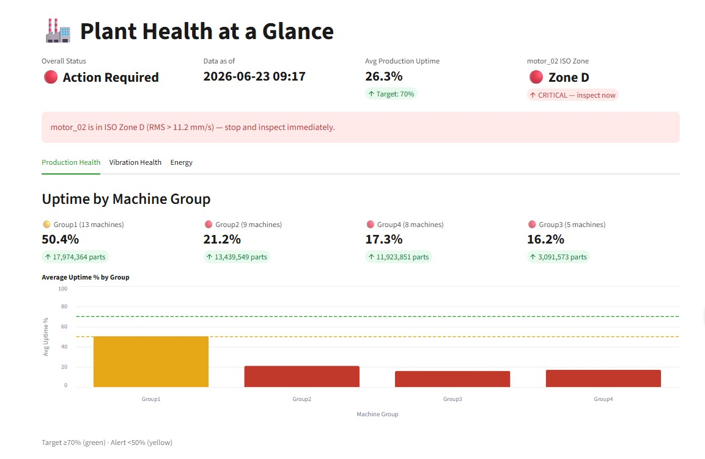
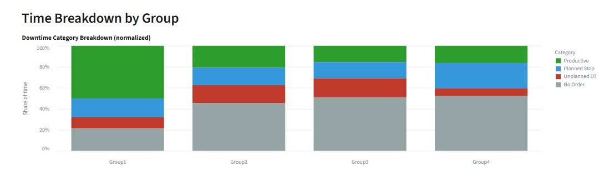
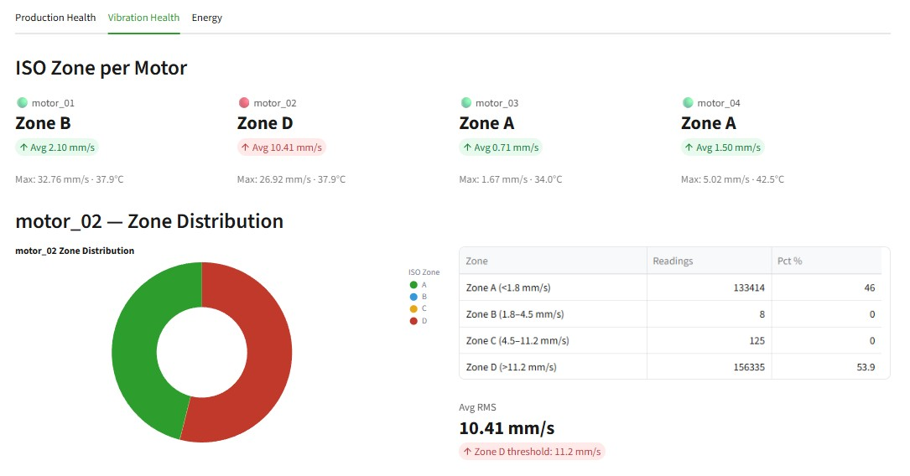
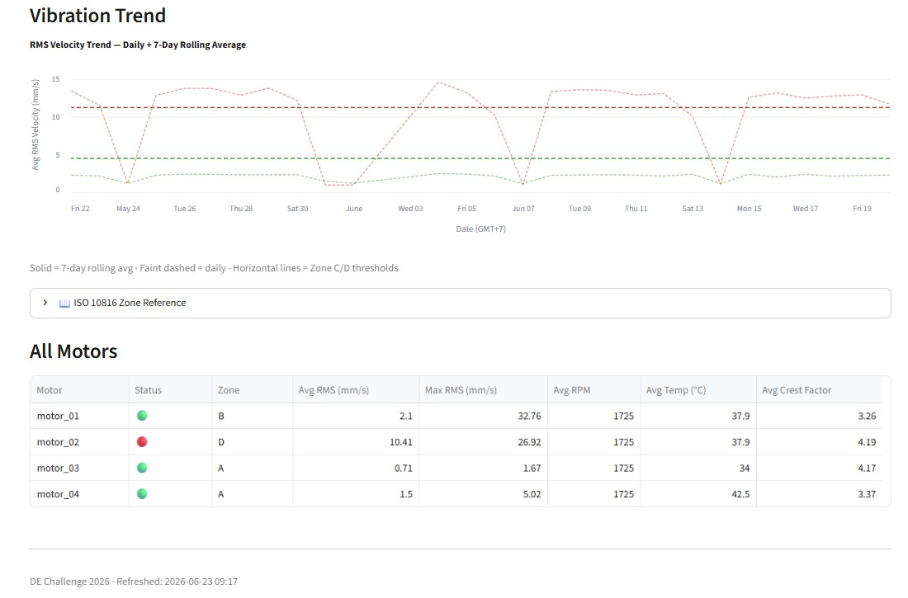
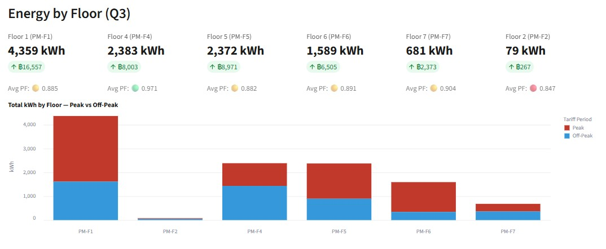
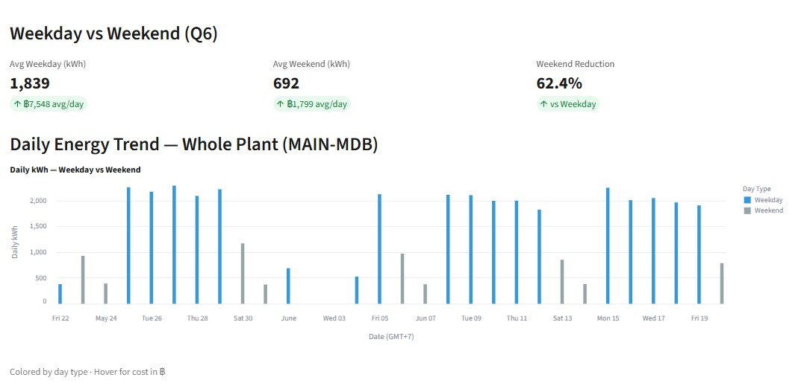
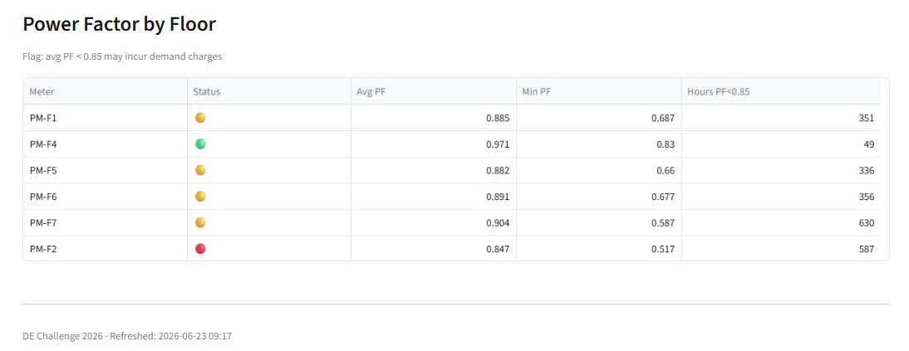

# Data Engineering Challenge 2026

## โจทย์ทดสอบ: Shop Floor to Insight Pipeline

### บริบท

คุณเพิ่งเข้าร่วมทีม Data ของโรงงานผลิตชิ้นส่วนอุตสาหกรรมในจังหวัดชลบุรี ประเทศไทย โรงงานแห่งนี้มีระบบเก็บข้อมูลแบบ Unified Namespace (UNS) ที่รวบรวมข้อมูลจาก:

- **เครื่องจักร Forming 38 ตัว** — ข้อมูล production state และ part counter
- **มอเตอร์ Chiller 4 ตัว** — ข้อมูล vibration sensor (Banner QM30VT2)
- **มิเตอร์ไฟฟ้า 8 ตัว** — ข้อมูล power consumption แยกตามชั้น

ข้อมูลทั้งหมดถูก stream เข้ามาใน Snowflake ผ่าน AWS IoT Core → Data Firehose → Snowpipe Streaming และลงในตาราง `RAW_EVENTS` เพียงตารางเดียว ซึ่งมีข้อมูลรวมกว่า **26 ล้าน rows**

หน้าที่ของคุณคือ: **ออกแบบและสร้าง data pipeline ที่แปลงข้อมูลดิบนี้ให้พร้อมใช้งาน**

---

### สิ่งที่ต้องทำ

โจทย์มีทั้งหมด **4 Tasks** ที่ผูกกับคำถามจริงจากผู้จัดการโรงงาน (อ่าน [scenario.md](scenario.md) ก่อน):

| Task | หัวข้อ | คะแนน |
|------|--------|--------|
| 1 | Data Understanding & Schema Design | 20 |
| 2 | Silver Pipeline (Incremental Transform) | 30 |
| 3 | Gold Aggregation (Analytics Layer) | 25 |
| 4 | AI-Assisted Capstone: Plant Health at a Glance | 25 |

**เวลา:** 3–7 วัน (Take-home)

---

### สิ่งที่อนุญาต

- **ใช้ AI tool ได้ทุกตัว** — Cortex Code, ChatGPT, Copilot, Claude ฯลฯ
- คุณจะถูกประเมินจาก **การตัดสินใจเชิงสถาปัตยกรรม** ไม่ใช่ syntax ของ SQL
- "AI ทำได้ 80% — ความเข้าใจทำอีก 20%" คือหลักการของโจทย์นี้

---

### ข้อกำหนดเบื้องต้น

1. **Snowflake Trial Account** — สมัครฟรีที่ [signup.snowflake.com](https://signup.snowflake.com) (เลือก AWS, region ap-southeast-1 Singapore)
2. **Snowflake Cortex Code (Desktop)** — ดาวน์โหลดที่ [Snowflake Downloads](https://other-docs.snowflake.com/en/cortex-code/downloading-cortex-code) (แนะนำ แต่ไม่บังคับ)

---

### วิธี Setup

#### 1. สร้าง Database และ Schema

รัน SQL จากไฟล์ [`sql/00_setup.sql`](sql/00_setup.sql) — จะสร้าง:
- Database: `DE_CHALLENGE`
- Schema: `BRONZE` (สำหรับ raw data)
- Schema: `SILVER` (สำหรับงานของคุณ)
- Schema: `GOLD` (สำหรับงานของคุณ)
- Warehouse: `CHALLENGE_WH` (X-Small, auto-suspend 60s)

#### 2. โหลดข้อมูลจาก S3

รัน SQL จากไฟล์ [`sql/01_load_from_s3.sql`](sql/01_load_from_s3.sql) — จะ:
- สร้าง External Stage ที่ชี้ไป `s3://appomax-de-challenge/`
- COPY ข้อมูล Parquet เข้าตาราง `RAW_EVENTS`
- ใช้เวลาประมาณ 5–10 นาที

#### 3. ตรวจสอบว่าข้อมูลโหลดครบ

```sql
SELECT SCHEMA_VERSION, COUNT(*) FROM DE_CHALLENGE.BRONZE.RAW_EVENTS
GROUP BY SCHEMA_VERSION ORDER BY COUNT(*) DESC;
```

ผลลัพธ์ที่คาดหวัง:
| SCHEMA_VERSION | COUNT |
|---|---|
| 0.1 | ~25,300,000 |
| vibration.raw.v1 | ~574,000 |
| vibration.raw.v2 | ~565,000 |
| power_meter.raw.v1 | ~299,000 |

---

### โครงสร้าง Repository

```
.
├── README.md                          ← คุณอยู่ที่นี่ (+ Video & Dashboard Preview)
├── DESIGN.md                          ← Architecture, Decision Log, Q1–Q7 mapping
├── REFLECTION.md                      ← สิ่งที่เรียนรู้ + ปัญหาที่เจอ
├── scenario.md                        ← สถานการณ์จำลอง + คำถามจากผู้จัดการ
├── challenge.md                       ← รายละเอียดโจทย์ทั้ง 4 tasks
├── snowflake.yml                      ← Snow CLI project config (Streamlit deploy)
├── sql/
│   ├── 00_setup.sql                   ← สร้าง database, schema, warehouse
│   ├── 01_load_from_s3.sql            ← โหลดข้อมูลจาก S3
│   ├── 02_silver_schema.sql           ← Silver DDL: Production + Vibration
│   ├── 02_silver_pipeline.sql         ← Silver pipeline: Stream + Task + MERGE (Prod + Vib)
│   ├── 02_silver_power.sql            ← Silver DDL + pipeline: Power/Energy
│   ├── 03_gold_aggregation.sql        ← Gold: Production + Vibration + Reference tables
│   ├── 03_gold_energy.sql             ← Gold: Energy (HOURLY + DAILY) + ENERGY_RATE_CONFIG
│   ├── 04_capstone_streamlit.sql      ← Streamlit object deploy + verification queries
│   └── RUN_ORDER.md                   ← ลำดับการรัน SQL
├── streamlit/
│   ├── plant_health.py                ← Dashboard app (3 tabs: Prod / Vib / Energy)
│   └── .streamlit/config.toml        ← Streamlit theme config
├── docs/
│   ├── screenshots/                   ← Dashboard screenshots (1.x Prod, 2.x Vib, 3.x Energy)
│   └── step1-bronze-exploration/
│       └── RAW_EVENTS_FINDINGS.md     ← Bronze exploration findings
├── reference/
│   ├── uns_schema.md                  ← UNS hierarchy + payload structure
│   ├── isa95.md                       ← ISA-95 model cheatsheet
│   └── data_dictionary.md             ← รายละเอียด field ทั้งหมด
└── hints/                             ← ถ้าติดปัญหา ดู hint ได้ (แต่จะถูกหักคะแนน)
```

---

### การส่งงาน

ส่งผลงานเป็น **Git repository** (GitHub/GitLab) ที่ประกอบด้วย:

1. **SQL files** ทั้งหมดที่ใช้สร้าง Silver/Gold tables และ pipelines
2. **`DESIGN.md`** — เอกสารอธิบายการตัดสินใจเชิงสถาปัตยกรรมของคุณ
3. **Screenshots หรือ Streamlit code** (สำหรับ Task 4)
4. **`REFLECTION.md`** — สรุปสิ่งที่เรียนรู้ ปัญหาที่เจอ และจะทำอะไรต่อถ้ามีเวลาเพิ่ม

---

### คำแนะนำ

- เริ่มจากการ **สำรวจข้อมูล** ก่อน — ดู payload, ดู pattern, ดูว่ามี domain อะไรบ้าง
- ไม่จำเป็นต้องทำทุก domain — เลือก 1-2 domain ที่ถนัดแล้วทำให้ดี ดีกว่าทำทุกอย่างแบบผิวเผิน
- อ่าน reference docs ให้ครบก่อนเริ่ม code
- ถ้าใช้ AI ช่วยเขียน code — ให้ **review และปรับ** ก่อน submit อย่า copy-paste โดยไม่เข้าใจ

---

### Credit

ข้อมูลจากโรงงานจริงในจังหวัดชลบุรี ประเทศไทย (anonymized)
จัดทำโดย [Appomax](https://appomax.co) สำหรับ Snowflake x AWS Manufacturing Day 2026

---

## Video Walkthrough

https://www.youtube.com/watch?v=hhqRf4AahKI

---

## Dashboard Preview

### Production Health




### Vibration Health




### Energy




